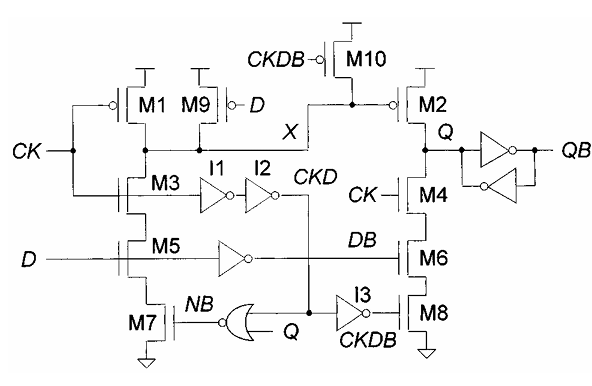
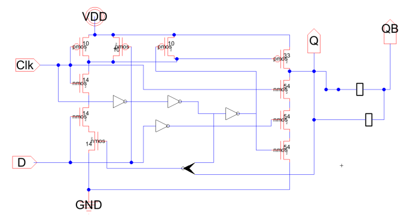
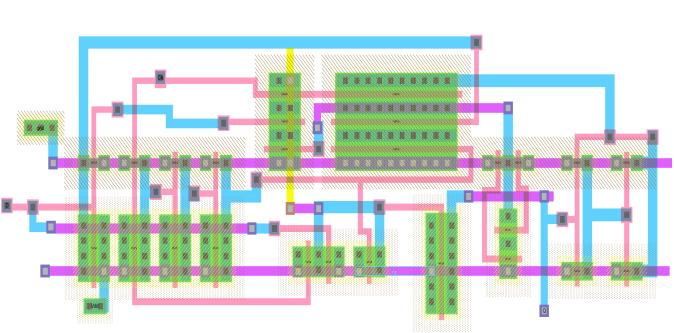
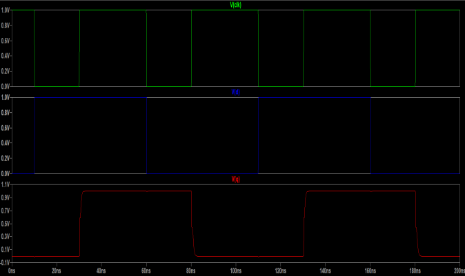
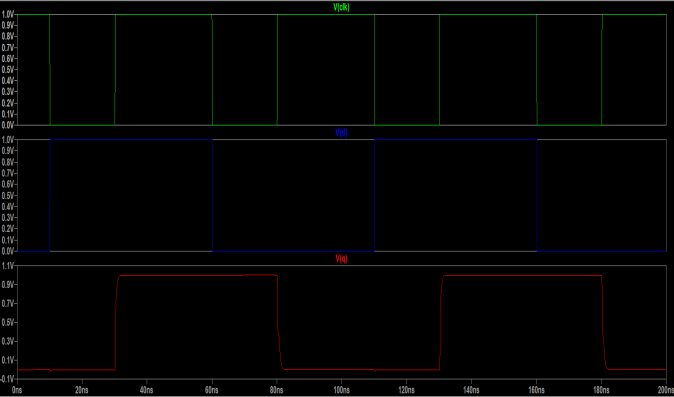

# D Flip-Flop IC Design in 32nm CMOS

A full custom VLSI implementation of a D Flip-Flop using 32nm Low-Power CMOS technology, designed and simulated in the Electric VLSI Design System.

## Project Overview

This project covers the complete design flow of a D Flip-Flop from schematic to physical layout, including SPICE simulation and timing/power analysis.

## Design Details

- **Technology:** 32nm Low-Power CMOS (mocmos)
- **Tool:** Electric VLSI Design System v9.08
- **Supply Voltage:** 1V (VDD)
- **Load Capacitance:** 20fF

---

## Reference Circuit

Transistor-level topology used as the reference for the design.

---

## Schematic

Full transistor-level schematic of the D Flip-Flop designed in Electric VLSI, with inputs Clk, D and outputs Q, QB.

---

## Physical Layout

VLSI layout of the flip-flop in 32nm CMOS, showing metal layers, active regions, polysilicon, and contacts.

---

## SPICE Simulation Results

Transient simulation showing the clock (green), D input (blue), and Q output (red) over 200ns.

---

## Cells / Modules

| Cell | Views |
|------|-------|
| `flip_flop` | Schematic, Layout, VHDL, ALS Netlist |
| `O_flip_flop` | Schematic |
| `inv` | Schematic, Icon |
| `keeper_inv` | Schematic, Icon |
| `norgate` | Schematic, Layout, Icon |
| `week_keeper` | Schematic, Icon |
| `structure` | Layout |

---

## Simulation Setup

SPICE transient simulation with the following measurements:

- **Rise Time (tr):** 10%–90% of output voltage
- **Fall Time (tf):** 90%–10% of output voltage
- **Average Power:** `VDD × avg_current`
- **Simulation Window:** 0 – 200ns

### Input Stimuli

| Signal | Type | Period |
|--------|------|--------|
| Clk | PULSE (0→1) | 50ns |
| D | PULSE (0→1) | 100ns |

---

## Files

- `project_final.jelib` — Electric VLSI project file (schematic, layout, netlist)
- `Report_IC.pdf` — Full project report with analysis and results
